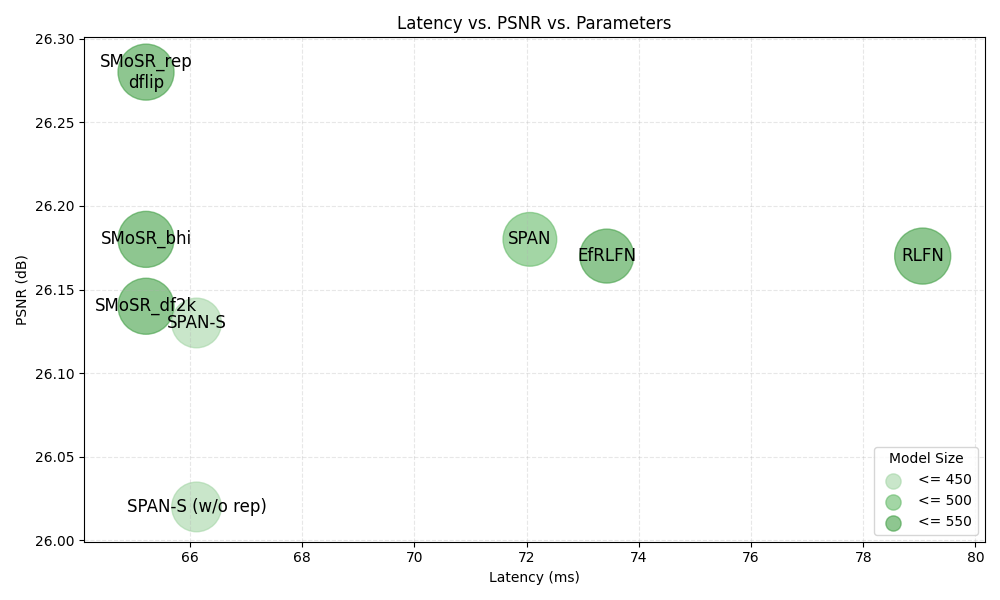

# SMoSR
Self Modulate Super-Resolution

  
  <!-- 
cell.
 -->

Urban100 4x:

| Arch      | bs_ssim_y | bs_psnr_y | ms 512x512 | mem use |
|-----------|-----------|-----------|------------|---------|
| SPAN-S    | 0.7865    | 26.13     | 66.12      | 1040M   |
| SPAN      | 0.7879    | 26.18     | 72.06      | 1123M   |
| SMoSR     | 0.7903    | 26.28     | 65.22      | 407M    |

Urban100 2x:

| Arch      | bs_ssim_y | bs_psnr_y |
|-----------|-----------|-----------|
| SPAN-S    | 0.9288    | 32.20     | 
| SPAN      | 0.9294    | 32.24     | 
| SMoSR     | 0.9299    | 32.35     | 
